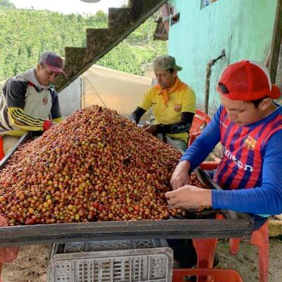
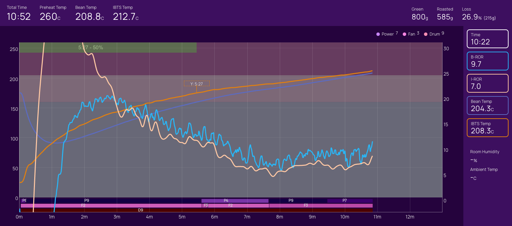

# Colombia Arley Calderon

## Technical Specs

Natural Anaerobic 200 hr - Caturron
Country: Колумбія

Region: Huila

Farm: Finca Villa Betulia
Farmer: Arley Calderon

Ground: Volcanic ashes

Різновид: Papayo

Висота: 1700-2000

Середні опади: 1900-2200mm

Середні температури: 18–24С

## Farmer Story

Arley Calderón is a young grower, he is a second-generation coffee grower born in Acevedo, Huila. He and his father Luis
Anibal Calderon own Villa Betulia a 20-hectare farm located at 1600 m.a.s.l in Acevedo, Huila. Luis Anibal was able to
buy Villa Betulia in 2005. Arley has been learning how to produce coffee from his father since he was a child. Also, he
has taken some courses and attended processing centers to understand how to create new processes and innovate in the
specialty coffee industry. Nowadays, Arley and his family produce some exotics such as Pink Bourbon, Gesha, Papayo, and
Ombligon, among others. In addition, they have been processing his coffee with Cofinet’s guidance. Arley is constantly
learning, and they take advantage of the Quality lab they have built in order to have better traceability of their
coffees!

## Farm Storoy

Villa Betulia is a 20-hectare farm located at 1600 m.a.s.l in Acevedo. The geographic and environmental characteristics
of this region make it the perfect place to cultivate specialty Coffee. The microclimate helps the coffee trees to
stress, leading to sweeter cherries. Also thanks to the location, it is possible to cultivate different varieties since
most of the varieties are suitable for that altitudes, they cultivate, Ombligon, Pink Bourbon, Gesha , among other
exotic varieties
#2145
Arley Calderon
Natural Anaerobic - Papayo

## Coffee Story

This coffee was carefully hand-picked in order to select only the ripest cherries. The cherries were then fermented for
40 hours in an anaerobic environment. Afterwards, the coffee was sundried until ideal moisture content was achieved.
This microlot is 100% Papayo. This varietal is a rare mutation that took place in Acevedo, Huila. Ripe cherries turn
orange in colour and the shape is similar to a papaya. The cup profile is complex with defined jasmine, sugar cane, and
sweet chocolate notes.

Arley Calderon

## Roast Story

